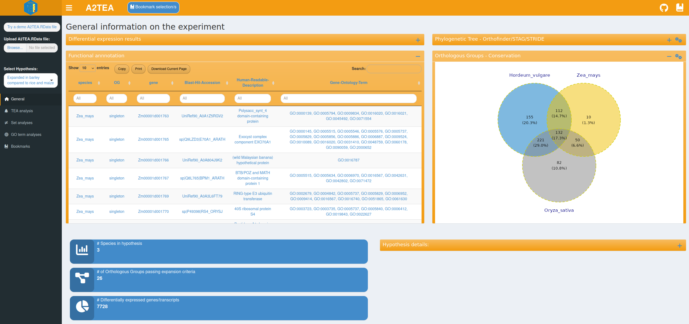
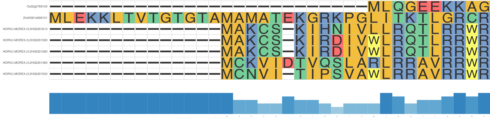
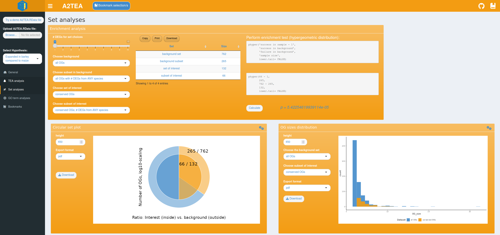
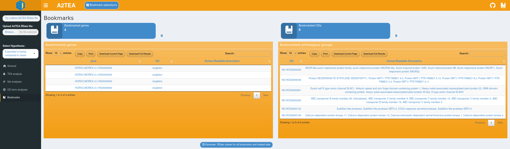

```{r, include = FALSE}
knitr::opts_chunk$set(
  collapse = TRUE,
  comment = "#>"
)
```

In this manual, we will illustrate the functionality of the A2TEA.WebApp, using the A2TEA.Workflow results of a three-species analysis of Hordeum vulgare (barley), Zea mays (maize) and Oryza sativa japonica (rice) that investigates adaptive processes in barley to drought stress.
Details on the files used as well as their respective publication and SRA accession numbers are listed on the start site.
We integrated this dataset into the workflow and the web application to illustrate the\` setup of the software and to allow for a quick exploration of the tools' functionalities.
After cloning the A2TEA.Workflow repository an additional script can be run (get_test_data.sh) that quickly sets up the experiment by downloading the required input files.
Peptide FASTA files are reduced to 2000 proteins; the transcriptomic data is subsampled to 2M reads to allow for a quicker runtime.
The functional annotations are precomputed by AHRD (<https://github.com/groupschoof/AHRD>).
The differential expression analysis is set to be performed on the gene level and two comparisons are performed as defined in the hypotheses.tsv table.
These are "Expanded in barley compared to rice and maize" and "Expanded in barley compared to maize".
For both, expansion is defined as "number of genes species A ≥ 2\* number of genes of species B".
The final output produced by the workflow is also integrated into the current release of the A2TEA.WebApp and can be loaded via clicking the "Try a demo A2TEA.RData file" at the top of the interface.

## Initial inspection of integrated data

You can either decide to load the included test dataset or upload a .RData result object.
Other options in the sidebar menu are a selector of the hypothesis (meaning: species comparison) to display or change to another analysis tab.
Genes, transcripts, or orthologous groups (OGs) can be marked in tables or via boxes ticked and then bookmarked with a dedicated button.
Bookmarks have their dedicated tab but can also be displayed as a sidebar window anywhere for quick reference purposes.
Analysis- or plot-specific parameters are displayed to the left of the visualization and a box-specific sidebar window for aesthetic parameters can be opened by clicking the gears icon.

{width="800"}

The general analysis tab is the default view inside the A2TEA.WebApp.
Once input is loaded, reactive information boxes appear that display the number of species, the number of expanded OGs and the number of DEGs for the currently selected hypothesis.
Changing the hypothesis e.g. to the second hypothesis in our test set ("Expanded in barley compared to maize") changes the statistics and all other sets/plots to reflect only the species considered in the hypothesis.
Two tables display gene-level differential expression results and functional annotation information (human readable descriptions and GO terms), which allow for example the exploration of genes related to a certain function.
Also displayed are an inferred phylogenetic tree of the species in the hypothesis subset and an intersection plot (Venn/UpSet) which displays the number of conserved (OG with \>= 1 gene from every species), overlapping, or species unique OGs and singleton genes.
Importantly, a table describing the details of the currently displayed hypothesis is also displayed.
All of this facilitates a broad overview of the data and also allows you to spot potential errors such as faulty hypothesis definitions or cutoffs that are too strict.

## Exploring expansion events with annotated phylogenetic trees

{width="800"}

The main feature of the TEA (trait-specific evolutionary adaptation) tab is a comprehensive toolkit for the visualization of maximum likelihood phylogenies of expanded OGs and associated information such as the log2(fold change) of the displayed genes and a multiple sequence alignment (MSA) of the respective protein sequences.\
Note that trying to show log2FoldChanges for a tree without any expression data present will result in an error message.\
The MSA can be added as a geometric layer to the tree plots or displayed separately with additional options such as a conservation bar (see below).
To make an informed decision of which OGs are most worthwhile to investigate closer, a table showcasing the total and significantly differentially expressed genes per OG is also provided.
With this, you enabled to apply several filters, for example to select all expanded OGs that possess at least 1 DEG and more than 4 genes from Hordeum vulgare.

We provide a couple of measures to more quickly glimpse especially interesting OGs from the table itself.
"norm_sum_expanded_sigDE" und "norm_compared_sigDE" provide the number of DEGs per OG but normalized by the number of species that are either investigated for expansion or the set of species that used for the comparison.
This table also includes CAFE5 p-values of gene family expansion as well as a over-representation test of significant expression and amount of expansion based on the background distribution of all investigated OGs (smaller values = more expansion and sig. expression in the investigated species).
Additionally a custom tea-value is provided - an experimental measure that tries to combine both prev.
measures with Fisher's combined probability test.

The last table on the tab provides insight into the reciprocal BLAST/DIAMOND hits for the currently chosen OG and the additional most similar OGs.
Notably, this table also provides the identifiers given to the proteins by Orthofinder making it easy to relate insight gained in the web application back to other outputs created by Orthofinder in the A2TEA.Workflow such as the list of putative xenologs.

{width="800"}

## Comparing sets of orthologous groups

{width="800"}

To describe adaptive processes at a larger scale we also integrated functionality to visualize distributions of user-defined OG sets and test for their over-representation; e.g. "What is the frequency of OGs that show expansion and at least 1 DEG in Hordeum vulgare in all conserved OGs?" and "Is this set over-represented within the background distribution of conserved OGs with at least 1 DEG from any species?".
We took care to make answering such questions very accessible by providing you with text-based choices of which sets to plot or compare.
Currently integrated are an enrichment analysis suite allowing for Fisher-Tests and a corresponding circular set plot that visualizes the chosen sets.
Also provided is a tool for comparing the size distributions of the OGs with which group size effects can be checked; e.g. "Do we see differences in the number of DEGs in OGs of a certain size range between the set of interest and the background set?".\
We have included several sets that allow for interesting insights to be gleamed.
The names of the sets are verbose and always reflect the order of filtering operations.
It is important to think about the sets of interest before diving into analysis (correct subsets, etc.) since the hypergeometric test otherwise does not provide useful insights.
One common thought to consider, is that, when your are interested in conserved OGs of the set of all species in the A2TEA run, that this is in fact a stricter criterium then only looking for conservation of a subset of species as part of a hypothesis set, since conservation in more species is less likely.\
The sets can be roughly grouped into 4 groups and are described in more detail in the following:\
[Group 1 - Basic Sets; broad filters on complete set of all species used in the A2TEA run; e.g., OG conservation and/or \# of DEGs:]{.underline}

-   "all OGs"
-   "all OGs with \# DEGs from ANY species"
-   "conserved OGs"
-   "conserved OGs; \# DEGs from ANY species"
-   "conserved OGs; \# DEGs from ALL species"

[Group 2 - Sets based on checking OG conservation in all species of the A2TEA run and **then** applying hypothesis level filters; e.g., \# of DEGs or expansion. Note - once the hypothesis level filter is applied, subsequent steps (e.g., \# DEGs) refer to only species in this hypothesis:]{.underline}

-   "conserved OGs; hypothesis; EXPANDED"
-   "conserved OGs; hypothesis; \# DEGs from ANY species"
-   "conserved OGs; hypothesis; \# DEGs from ANY EXPANDED species"
-   "conserved OGs; hypothesis; \# DEGs from ALL EXPANDED species"
-   "conserved OGs; hypothesis; EXPANDED; \# DEGs from ANY species"
-   "conserved OGs; hypothesis; EXPANDED; \# DEGs from ALL species"
-   "conserved OGs; hypothesis; EXPANDED; \# DEGs from ANY EXPANDED species"
-   "conserved OGs; hypothesis; EXPANDED; \# DEGs from ALL EXPANDED species"

[Group 3 - Sets that filter for hypothesis level species and do not specify any conservation of OGs (note that requiring DEGs from all species is in the end also a filter of conservation):]{.underline}

-   "hypothesis; all OGs; EXPANDED"
-   "hypothesis; all OGs; \# DEGs from ANY species"
-   "hypothesis; all OGs; \# DEGs from ANY EXPANDED species"
-   "hypothesis; all OGs; \# DEGs from ALL EXPANDED species"
-   "hypothesis; all OGs; EXPANDED; \# DEGs from ANY EXPANDED species"
-   "hypothesis; all OGs; EXPANDED; \# DEGs from ALL EXPANDED species"

[Group 4 - Sets that perform the filters (conservation, hypothesis) in a reverse order compared to Group 2. Here, first the analyzed species are reduced to those included in the hypothesis and **then** conservation and additional filters are applied. In terms of the conservation this is ultimately less strict than requiring conservation of OGs from all species in the A2TEA run as performed in Group 2:]{.underline}

-   "hypothesis; conserved OGs; EXPANDED"
-   "hypothesis; conserved OGs; \# DEGs from ANY species"
-   "hypothesis; conserved OGs; \# DEGs from ANY EXPANDED species"
-   "hypothesis; conserved OGs; \# DEGs from ALL EXPANDED species"
-   "hypothesis; conserved OGs; EXPANDED; \# DEGs from ANY species"
-   "hypothesis; conserved OGs; EXPANDED; \# DEGs from ALL species"
-   "hypothesis; conserved OGs; EXPANDED; \# DEGs from ANY EXPANDED species"
-   "hypothesis; conserved OGs; EXPANDED; \# DEGs from ALL EXPANDED species"

## Performing functional enrichment tests

{width="800"}

The last analysis tab provides options for performing GO term over-representation analysis based on the topGO R package.
Functions that occur more often than expected can be identified by setting several parameters that specify the set of OGs you want to analyze.

The background "universe" is the non-redundant superset set of GO terms of all genes of all species in OGs [conserved in all species of the A2TEA run]{.underline} (singletons are currently not included).
Whatever is compared to the universe in the analysis, is always a [subset]{.underline} of it.
Basically, the choice of hypothesis, expansion filter (yes/no) and DEG criterium (e.g., "at least N \# of DEGs in any hypothesis species") reduce the universe set to a target subset which we want to check for significant enrichment of GO terms.
The ontology of interest (Biological Process (BP), Molecular Function (MF) or Cellular component (CC)) and further options can also be set.

With our test data, you could for instance be interested in enriched molecular functions of OGs that are expanded in Hordeum vulgare and also possess at least 2 DEGs of Hordeum vulgare.
Once computed, a table is displayed that shows the top significantly enriched GO terms and also contains dynamically created links for these to AmiGO2.
A second table contains information on the corresponding OGs and genes so that you are able to follow up on a particular enriched GO term and inspect the underlying data.
We also provide two visualizations that summarize the results.
The first is a GO enrichment dotplot (Figure 4D) showcasing the overall results in a straightforward way and the second is a GO subgraph of selected top N enriched GO terms.
With the latter, we provide you with an insightful way of investigating how the significant GO terms are distributed over the GO graph.

{width="800"}

## Export options, bookmarking & ending a session

{width="800"}

Tables can be downloaded as .tsv files and plots are exportable into a variety of formats such as .pdf, .png, or .svg which allows the you to easily save and share the observations and results.
However, even a relatively small set of species, like the three Poaceae species in our test data, lead to several OGs that are worthwhile to investigate which substantiates the need for the bookmarking system outlined in the Implementation section.
It quickly becomes very valuable to simply bookmark e.g. all OGs annotated with the top 5 enriched BP GO terms in the OGs expanded in Hordeum vulgare if the intention is to return to the analysis at a later time or to quickly generate a list to use with another tool.
Relating this to the previous sub-sections we want to emphasize that bookmarking is an integral part of using the A2TEA.WebApp and is fully featured on all analysis tabs except the "Set analyses", since here individual genes or OGs are not the focus.
To further aid in the bookmarking process we also added informative pop-up messages to indicate for instance that all selected genes/OGs have already been saved.
Since the bookmarks can also be used to export a completely functional .RData subset file, only the most relevant information is kept while the processing speed is increased and all relevant results of the integrative effort are kept.
If for instance, during the analysis it turned out that hypothesis 2 in our example data ("Expanded in barley compared to maize") is in fact not of interest anymore, subsetting the .RData file to interesting OGs of hypothesis 1 completely removes the unneeded "bloat" of hypothesis 2.
Similarly, you can create 2 .RData files (one for each hypothesis) and run a custom script on each of them separately, thereby easily producing hypothesis-specific results.
